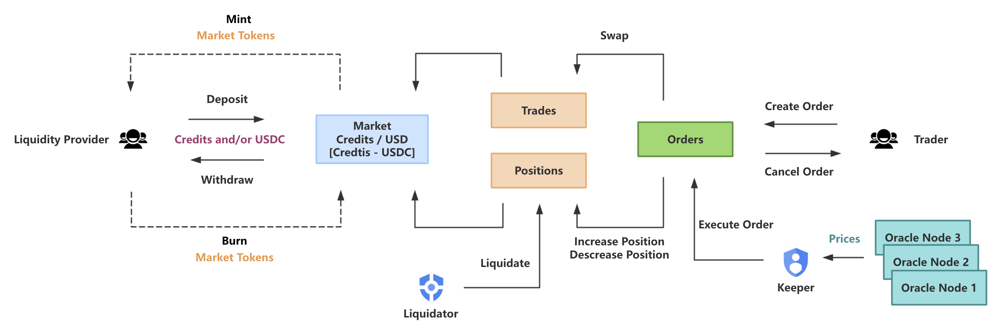

# aleox

AleoX is a decentralized perpetual & spot exchange on Aleo.
It supports both sport and perp trading, and allows users to trade with up to 100x leverage.

# System Design

### Features

AleoX support the following main features:
- Deposit and withdrawal of liquidity
- **Public/Private** Spot Trading (Swaps)
- **Public/Private** Leverage Trading (Perps, Long / Short)
- Market orders, limit orders, stop-loss, take-profit orders
- Liquidation

### Privacy and MEV mitigation

AleoX allows users to create swap orders and perps orders with zero-knowledge proofs (supported by Aleo builtin features) instead of their personal information, which reduces the amount of sensitive data observed by MEV exploiters.

### Markets

Markets support both spot and perp trading, which are created by specifying a long collateral token, short collateral token and index token.

Examples:
- Credits/USD market with long collateral as Credits, short collateral as a stablecoin, index token as Credits
- BTC/USD market with long collateral as BTC (WBTC), short collateral as a stablecoin, index token as BTC
- SOL/USD market with long collateral as ETH (WETH), short collateral as a stablecoin, index token as SOL (WSOL)

Liquidity providers can deposit either the long or short collateral token or both to mint liquidity tokens.

The long collateral token is used to back long positions, while the short collateral token is used to back short positions.

Liquidity providers take on the profits and losses of traders for the market that they provide liquidity for.

Having separate markets allows for risk isolation, liquidity providers are only exposed to the markets that they deposit into, this potentially allow for permissionless listings.

Traders can use either the long or short token as collateral for the market.

### Oracle System

To avoid front-running issues, most actions require two steps to execute:

- User sends transaction with request details, e.g. deposit / withdraw liquidity, swap, increase / decrease position
- Keepers listen for the transactions, include the prices for the request and then send a transaction to execute the request

Prices are provided by an off-chain oracle system, which continually signs prices based on the time the prices were queried.

Both a minimum price and a maximum price is signed, this allows information about bid-ask spreads to be included.

### Fees and Pricing

Funding fees and price impact keep longs / shorts balanced while reducing the risk of price manipulation.

- Funding fees: if there is an imbalance of longs / shorts, the larger side pays a funding fee to the smaller side.
- Borrowing fees: to avoid a user opening equal longs / shorts and unnecessarily taking up capacity.
- Price impact: this allows the programs to simulate a price impact similar to if the trader were trading using an aggregator for the reference exchanges, there is a negative price impact if an action reduces balance, and a positive price impact if an action improves balance.

### Keepers

There are a few keeper services in the system:

- Oracle keepers: pull prices from reference exchanges, sign and store the information, and allows querying of this information.
- Order keepers: checks for deposit / withdraw liquidity requests, order requests, bundles the signed oracle prices with the requests and executes them.

# Programs

- Config: stores various configuration parameters.
- Market: mints & burns the market tokens, keeps track of the liquidity providers, and stores the index/long/short tokens.
- Position: stores the long or short position size and the amount of the collateral token; allows users to open (increase) and close (decrease) positions.
- Order: allows users to create orders and cancel orders; allows keepers to execute orders.
- Oracle: stores the signed prices and allows querying of the prices.

# Core Transitions

#### createDeposit

Creates a new deposit with the given market, long token amount and short token amount.

```
struct CreateDepositParams {
    market: field,
    longTokens: u128,
    shortTokens: u128,
    minMarketTokens: u128,
    executionFee: u128,
}

async transition createDeposit(public params: CreateDepositParams) -> Future;
```

#### executeDeposit

Execute a deposit by the key id, including the signed prices.

```
struct Price {
    token: field,
    min: u128,
    max: u128,
    timestamp: u128,
    provider: address,
    sig: signature,
}

struct SetPricesParams {
    indexToken: Price,
    longToken: Price,
    shortToken: Price,
}

async transition executeDeposit(public key: u32, public params: SetPricesParams) -> Future;
```

#### createWithdrawal

Create a new withdrawal with the given market and market token amount.

```
struct CreateWithdrawalParams {
    market: field,
    marketTokens: u128,
    minLongTokens: u128,
    maxShortTokens: u128,
    executionFee: u128,
}

async transition createWithdrawal(public params: CreateWithdrawalParams) -> Future;
```

#### executeWithdrawal

Execute a withdrawal by the key id, including the signed prices.

```
async transition executeWithdrawal(public key: u32, public params: SetPricesParams) -> Future;
```

#### createOrder

Create a new public order with the given market and other parameters.

```
struct CreateOrderParams {
    market: field,
    collateralTokenIsLong: bool,
    sizeDeltaUsd: u128,
    collateralTokenDeltaAmount: u128,
    triggerPrice: u128,
    acceptablePrice: u128,
    executionFee: u128,
    minOutputAmount: u128,
    orderType: u8,
    isLong: bool,
    autoCancel: bool,
}

async transition createOrder(public params: CreateOrderParams) -> Future;
```

#### createOrderPrivate

Create a new private order with the given market and other parameters.

```
record OrderRecord {
    owner: address,
    market: field,
    collateralTokenIsLong: bool,
    sizeDeltaUsd: u128,
    collateralTokenDeltaAmount: u128,
    triggerPrice: u128,
    acceptablePrice: u128,
    executionFee: u128,
    minOutputAmount: u128,
    orderType: u8,
    isLong: bool,
    autoCancel: bool,
}

async transition createOrderPrivate(params: CreateOrderParams) -> (OrderRecord, Future);
```

#### executeOrder

Execute an order by the key id, including the signed prices.

```
async transition executeOrder(public key: u32, public params: SetPricesParams) -> Future;
```

#### executeOrderPrivate

Execute a private order, including the signed prices.

```
async transition executeOrderPrivate(order: OrderRecord, public params: SetPricesParams) -> Future;
```

# User Flow

The user flow of AleoX is as follows:


